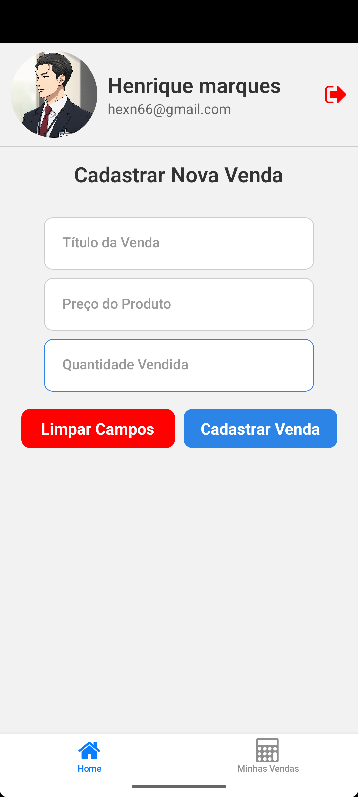
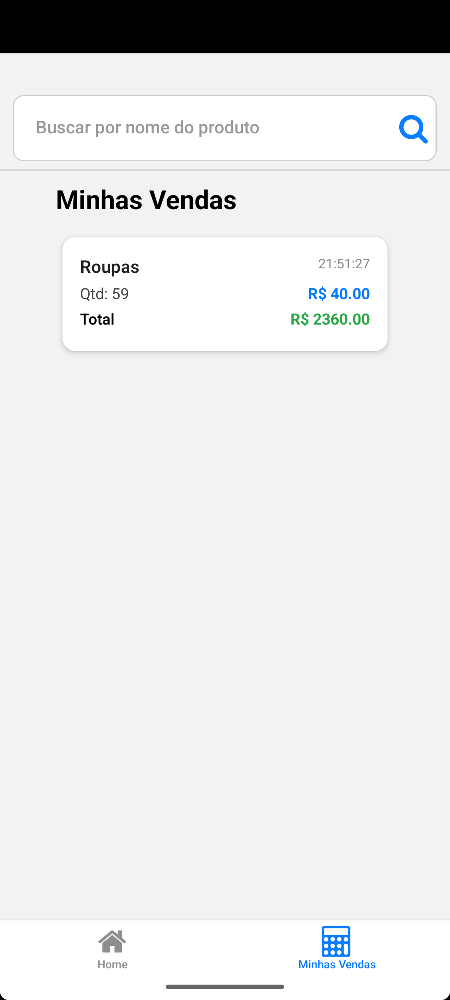

# 📊 gestorX

**gestorX** é um aplicativo mobile simples e funcional para controle de vendas, desenvolvido como trabalho de extensão acadêmica. Ele permite ao usuário registrar produtos vendidos, preços, quantidades e acompanhar suas vendas de forma organizada. Tudo isso com persistência local de dados usando SQLite.

---

## 🚀 Funcionalidades

- 🔐 Login com persistência de sessão
- 🛍️ Cadastro de vendas (produto, preço, quantidade)
- 📄 Listagem de vendas organizadas com total por item
- 📦 Banco de dados local com SQLite
- 📱 Interface amigável e responsiva

---

## 🛠️ Tecnologias Utilizadas

- [React Native](https://reactnative.dev/)
- [Expo](https://expo.dev/)
- [expo-router](https://expo.github.io/router/)
- [expo-sqlite](https://docs.expo.dev/versions/latest/sdk/sqlite/)
- [AsyncStorage](https://react-native-async-storage.github.io/async-storage/)
- [expo-haptics](https://docs.expo.dev/versions/latest/sdk/haptics/)

---

## 🖼️ Screenshots

| Tela de Login | Cadastro de Venda |
|:-------------:|:------------------:|
|  |  |

| Lista de Vendas | Feedback de Sucesso |
|:---------------:|:-------------------:|
|  |  |

## 📦 Como Executar

```bash
git clone https://github.com/HenriqueMarques-dev/projetoExtensaoEstacioAndroid.git
cd gestorx
npm install
npx expo start
